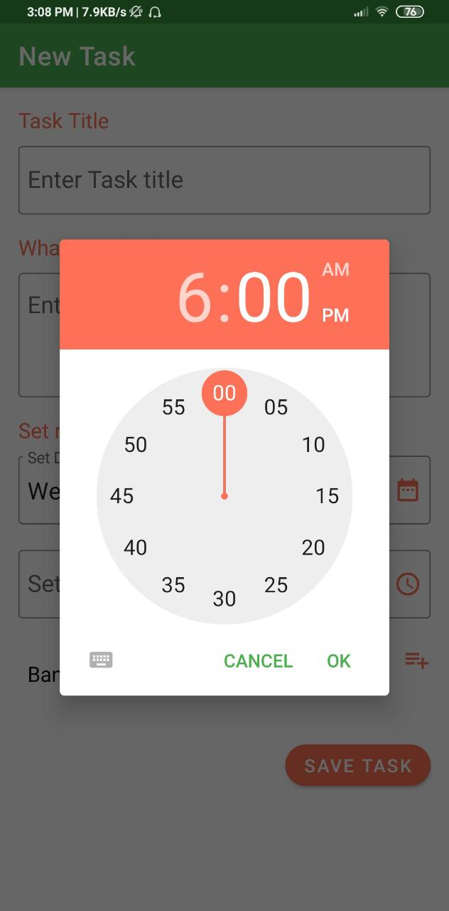
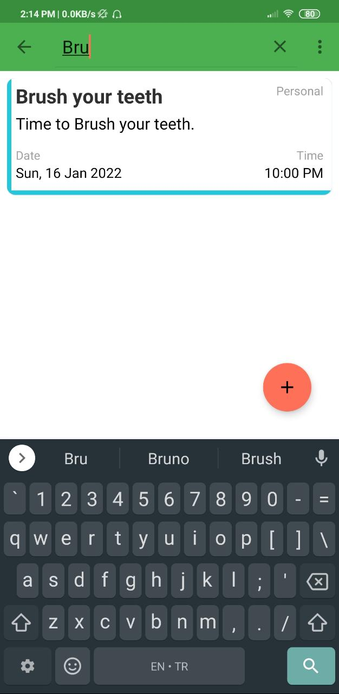

    
    <h1 align="center">ToDo List App</h1>

## 🌟 About
A simple To-Do List Management App that helps you get things done. Built with Kotlin, it helps the user to add their task. User can mark an added task as completed . They can delete the completed task or all added task as they wish. It saves the data in local database using Room.

## ✨ Screenshots

 

